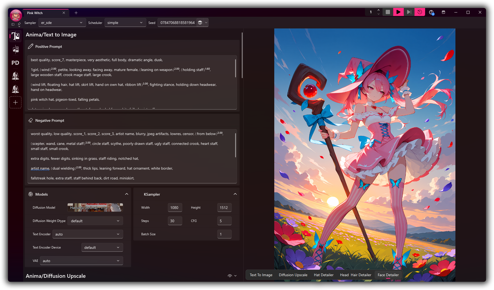
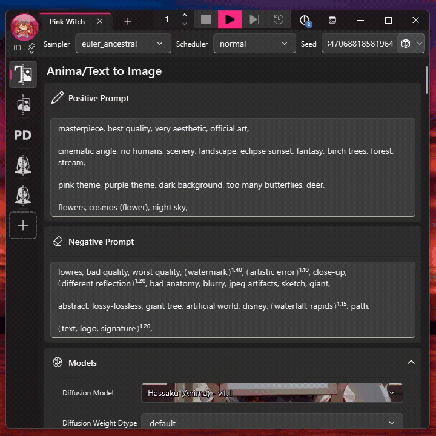
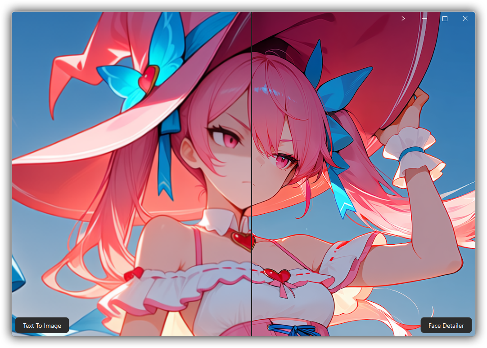

<p align="center">
  
</p>

<p align="center">
  <a href="https://github.com/Artificial-Sweetener/SugarSubstitute/releases/latest"></a>
  <a href="https://github.com/Artificial-Sweetener/SugarSubstitute/actions/workflows/release.yml"></a>
  <a href="https://github.com/Artificial-Sweetener/SugarSubstitute/releases"></a>
  <a href="https://www.gnu.org/licenses/gpl-3.0.html"></a>
</p>

<p align="center">
  <a href="README.md">English</a> | <a href="README.zh-Hans.md">简体中文</a> | <a href="README.ja.md">日本語</a> | <a href="README.ko.md">한국어</a> | <strong>Español</strong>
</p>

**SugarSubstitute es la interfaz en Qt para [ComfyUI](https://github.com/Comfy-Org/ComfyUI), creada para quienes adoran todo lo que puede hacer un grafo, pero preferirían no pasar el día entero desenredando uno.**

No dejaba de construir las mismas secciones de un flujo de trabajo, activarlas y desactivarlas, moverlas y volver a conectarlas. Hasta que me cansé. Esas secciones se convirtieron en [**Cubos**](https://github.com/Artificial-Sweetener/SugarCubes), y la aplicación de escritorio que los rodea se convirtió en SugarSubstitute.

**SugarSubstitute está en beta pública.** Windows x64, Apple Silicon y Linux x64 cuentan con instaladores específicos.

**[Descarga la última beta](#instalación)** para Windows x64, Apple Silicon o Linux x64.

Consulta la [hoja de ruta](ROADMAP.md) para ver qué quiero crear a continuación y dime qué me falta.

<p align="center">
  
  <br>
  <em>El espacio de trabajo principal reúne la pila de Cubos, el prompt, los controles de generación y el último resultado.</em>
</p>

## La versión breve

- **Apila partes de un flujo de trabajo, no nodos sueltos.** Añade, reordena, silencia o elimina Cubos mientras SugarSubstitute se ocupa de los enlaces.
- **Deja de esperar a que tu WebUI sea compatible.** Si ComfyUI puede ejecutar un modelo, puedes incorporarlo a SugarSubstitute mediante un Cubo. Si puedes construir un grafo de ComfyUI, puedes crear uno.
- **Actualiza todos tus flujos de trabajo de una sola vez.** ¿Te has dado cuenta de que deberías ampliar la resolución de otra manera o acaba de aparecer una nueva técnica de inpainting? Actualiza únicamente el Cubo que contiene el segmento afectado y todos tus flujos de trabajo de Substitute se pondrán al día.
- **Deja de repetirte.** Cambia las semillas, los muestreadores y demás ajustes compatibles una sola vez, sin tener que buscarlos por todo el flujo de trabajo.
- **Un completo editor de prompts diseñado específicamente para generar imágenes.** El autocompletado, la presentación enriquecida, los LoRA, los comodines, el énfasis, las escenas y los segmentos arrastrables conviven en un único editor.
- **Explora modelos con los ojos.** Busca entre miniaturas y metadatos en lugar de adentrarte en un vertedero de nombres de archivo.
- **Trabaja junto a la imagen.** Carga, enmascara, genera, compara y vuelve a abrir resultados sin saltar de una herramienta a otra.
- **Comparte la receta completa.** Un PNG de receta puede incluir el flujo de trabajo, los prompts, la configuración y las pruebas necesarias para recuperar de forma segura los modelos que falten.

## Mira SugarSubstitute en acción

<p align="center">
  <a href="https://www.youtube.com/watch?v=wfamuJZCD2c">
    
  </a>
  <br>
  <em>Haz clic en la vista previa para ver la presentación de la beta de SugarSubstitute en YouTube.</em>
</p>

## Es una beta. Ponla a prueba.

SugarSubstitute está en beta pública. La uso para trabajo real, pero aún espero encontrar asperezas. Si la instalación falla, algo se bloquea o una tarea normal resulta más extraña de lo que debería, [abre una incidencia](https://github.com/Artificial-Sweetener/SugarSubstitute/issues) e incluye lo que estabas haciendo y cualquier diagnóstico que proporcione SugarSubstitute.

**Compatibilidad de hardware:** desarrollo y ejecuto inferencias con hardware de NVIDIA. La instalación administrada también contempla GPU AMD e Intel compatibles, Apple MPS e inferencia solo por CPU en Windows, pero no he probado personalmente esas configuraciones de hardware. Si pruebas alguna, dime el hardware y el sistema operativo exactos, si la instalación terminó y si la generación funcionó. Los informes positivos también importan; el silencio y la perfección se parecen demasiado desde aquí.

## Instalación

El instalador puede crear un entorno administrado de ComfyUI o conectarse a uno que ya uses. La instalación administrada emplea entornos autónomos de Python verificados mediante suma de comprobación y un cliente libgit2 integrado en el proceso, por lo que no necesita ni Python ni Git instalados en el sistema. La primera ejecución puede tardar mientras se descargan los componentes necesarios. Déjalo trabajar.

**¿Ya lo tienes instalado?** Abre SugarSubstitute normalmente. Al iniciarse busca actualizaciones de la aplicación, por lo general una vez al día, e instala automáticamente las versiones nuevas. Normalmente no necesitarás descargar otro instalador.

###  Windows x64

**[Descarga el último instalador para Windows x64](https://github.com/Artificial-Sweetener/SugarSubstitute/releases/latest/download/SugarSubstitute-Installer-Windows-x64.exe)**

Ejecuta el instalador y elige una carpeta normal con permisos de escritura, como `C:\SugarSubstitute`. Evita Archivos de programa, ya que los permisos de Windows pueden interferir con la instalación y las actualizaciones.

La instalación administrada admite NVIDIA mediante CUDA, hardware AMD RDNA compatible mediante ROCm, GPU Intel mediante XPU y una alternativa por CPU. La aceleración de AMD en Windows se limita a las familias RDNA 3, RDNA 3.5 y RDNA 4 compatibles con el entorno administrado. El resto del hardware AMD utiliza la CPU en lugar de arriesgarse con un entorno incompatible.

Siguiente paso: [elige cómo debe usar ComfyUI SugarSubstitute](#elige-tu-instalación-de-comfyui).

###  macOS Apple Silicon

**[Descarga el último instalador para macOS Apple Silicon](https://github.com/Artificial-Sweetener/SugarSubstitute/releases/latest/download/SugarSubstitute-Installer-macOS-Apple-Silicon.dmg)**

Abre el DMG, inicia SugarSubstitute Setup y usa la carpeta predeterminada `~/Applications/SugarSubstitute` u otra carpeta que te pertenezca. La instalación administrada utiliza la aceleración MPS de Apple en Apple Silicon. Los Mac con Intel no son compatibles.

SugarSubstitute lleva una firma ad hoc, pero no está notarizada porque este proyecto no participa en el programa de pago para desarrolladores de Apple. macOS advertirá que no puede verificar al desarrollador. Si descargaste el DMG desde este repositorio, permite que se abra desde la configuración de Privacidad y seguridad de macOS.

Solo he probado SugarSubstitute directamente en Windows. El paquete para macOS se compila en Apple Silicon mediante GitHub Actions, pero aún necesita que más personas lo usen en equipos Mac reales.

Siguiente paso: [elige cómo debe usar ComfyUI SugarSubstitute](#elige-tu-instalación-de-comfyui).

###  Linux x64

Elige el paquete adecuado para tu sistema:

- **[Descarga la última AppImage para Linux x86_64](https://github.com/Artificial-Sweetener/SugarSubstitute/releases/latest/download/SugarSubstitute-Installer-Linux-x86_64.AppImage)** si quieres un instalador portátil. Márcala como ejecutable y ábrela.
- **[Descarga el último paquete Debian para Linux amd64](https://github.com/Artificial-Sweetener/SugarSubstitute/releases/latest/download/SugarSubstitute-Installer-Linux-amd64.deb)** para Debian, Ubuntu y distribuciones relacionadas. Instala el paquete y ejecuta `sugarsubstitute-setup`.

La carpeta de instalación predeterminada es `~/.local/share/SugarSubstitute`. La instalación administrada admite NVIDIA mediante CUDA, AMD mediante ROCm y GPU Intel mediante XPU. Actualmente no hay disponible ningún entorno administrado de Linux que funcione solo con CPU.

Solo he probado SugarSubstitute directamente en Windows. Los paquetes para Linux se compilan en Linux mediante GitHub Actions, pero aún necesitan que más personas los usen en distribuciones y entornos de escritorio reales.

Siguiente paso: [elige cómo debe usar ComfyUI SugarSubstitute](#elige-tu-instalación-de-comfyui).

### Desde un clon de Git

Usa una copia del código fuente cuando quieras ejecutar SugarSubstitute directamente desde el repositorio y modificarlo. Este método necesita Git y Python 3.12.

En Windows, abre PowerShell y ejecuta:

```powershell
git clone https://github.com/Artificial-Sweetener/SugarSubstitute.git
Set-Location SugarSubstitute
py -3.12 -m venv .venv
.\.venv\Scripts\python.exe -m pip install --upgrade pip
.\.venv\Scripts\python.exe -m pip install -r requirements.txt pytest pytest-xdist ruff mypy pre-commit
.\.venv\Scripts\pre-commit.exe install
.\.venv\Scripts\python.exe main.py
```

En macOS o Linux, abre una terminal y ejecuta:

```bash
git clone https://github.com/Artificial-Sweetener/SugarSubstitute.git
cd SugarSubstitute
python3.12 -m venv .venv
.venv/bin/python -m pip install --upgrade pip
.venv/bin/python -m pip install -r requirements.txt pytest pytest-xdist ruff mypy pre-commit
.venv/bin/pre-commit install
.venv/bin/python main.py
```

La primera ejecución desde el código fuente abre el mismo proceso de instalación que la aplicación empaquetada. Deja que cree un entorno administrado de ComfyUI o conéctalo a uno existente. Una vez terminada la instalación, vuelve a usar el último comando cada vez que quieras ejecutar tu copia de desarrollo.

### Elige tu instalación de ComfyUI

La primera vez que se abre, SugarSubstitute pregunta cómo debe usar ComfyUI. Puedes cambiar la conexión más adelante en Configuración.

#### Deja que SugarSubstitute instale ComfyUI

Esta es la opción recomendada para la mayoría de los usuarios. SugarSubstitute crea un espacio de trabajo local e independiente para ComfyUI, elige el backend de inferencia adecuado para tu hardware, instala ComfyUI Manager y los nodos personalizados necesarios e inicia y detiene esta copia junto con la aplicación. Mantiene el entorno administrado separado de cualquier instalación de ComfyUI que ya utilices. No se necesita Python ni Git en el sistema.

Elige esta opción si quieres que SugarSubstitute se encargue de todo el entorno de ComfyUI y lo mantenga listo.

#### Usa tu ComfyUI local

Elige la carpeta que contiene el archivo `main.py` de tu instalación de ComfyUI. SugarSubstitute conserva el repositorio y los modelos en su sitio, pero prepara ese entorno de ComfyUI para SugarSubstitute, incluidas sus dependencias de Python, ComfyUI Manager y los nodos personalizados necesarios. A continuación, SugarSubstitute inicia esta copia mientras se ejecuta la aplicación.

Elige esta opción si quieres tener una única instalación local de ComfyUI y no te importa que SugarSubstitute la prepare y la inicie.

#### Conéctate a un ComfyUI remoto

La compatibilidad con ComfyUI remoto aún no se ha probado. SugarSubstitute guarda el host y el puerto remotos, pero no puede instalar ni reparar nada en el equipo remoto. Mantén el servidor accesible a través de una LAN o VPN de confianza y evita exponer ComfyUI directamente a Internet.

Instala estos nodos personalizados y sus dependencias de Python declaradas en el entorno remoto de ComfyUI antes de conectarte:

- [Substitute BackEnd](https://github.com/Artificial-Sweetener/Substitute-BackEnd)
- [SugarCubes](https://github.com/Artificial-Sweetener/SugarCubes)
- [ComfyUI Vectorscope CC](https://github.com/pamparamm/ComfyUI-vectorscope-cc)
- [ComfyUI SeedVR2 Video Upscaler](https://github.com/numz/ComfyUI-SeedVR2_VideoUpscaler)
- [SimpleSyrup](https://github.com/Artificial-Sweetener/SimpleSyrup)
- [ComfyUI Prompt Control](https://github.com/asagi4/comfyui-prompt-control)

Reinicia el servidor remoto de ComfyUI después de instalar los nodos e introduce el host y el puerto durante la instalación de SugarSubstitute.

## Cubos, no espaguetis de cables

Un Cubo es una parte versionada de un grafo de ComfyUI con entradas, salidas y controles declarados. Apila los que necesites y SugarSubstitute conectará los extremos compatibles. Reordena, silencia o elimina uno y los enlaces se acomodarán a la nueva pila sin necesidad de una sesión de microcirugía en el grafo.

Quienes crean los Cubos deciden qué controles nativos aparecen en la superficie. Los reemplazos globales pueden reunir opciones compatibles de varios Cubos en un solo control de la barra de herramientas, y siempre puedes mostrar los controles más detallados cuando los necesites.

Los autores pueden publicar sus paquetes de Cubos en GitHub y los usuarios pueden suscribirse a los cambios. Cuando cambie un Cubo, fija la versión en la que confíes o actualízalo conservando los valores y enlaces compatibles.

## Deja de esperar a que tu WebUI se ponga al día

SugarSubstitute proporciona a ComfyUI una interfaz familiar al estilo de una WebUI sin obligar a que la compatibilidad con nuevos modelos espere al lanzamiento de una nueva versión de la interfaz. Si ComfyUI puede ejecutarlo, SugarSubstitute puede ofrecerlo mediante un Cubo. Usa un Cubo existente o crea el tuyo. Si puedes construir un grafo de ComfyUI, puedes crear un Cubo. La compatibilidad con el modelo llega junto al flujo de trabajo, no cuando la interfaz consigue alcanzarlo.

## Los prompts deberían sentirse vivos

El editor de prompts comprende la estructura que presenta. El autocompletado aparece donde estás escribiendo, mientras que el énfasis, los LoRA, los comodines, la puntuación, la selección y el historial para deshacer permanecen intactos. Incluso puedes arrastrar fragmentos separados por comas entre líneas ajustadas o moverlos con el teclado.

<p align="center">
  
  <br>
  <em>Un editor de prompts que no te pide memorizar reglas de escape y te permite hacer cambios rápidos sin quitar la mano del ratón.</em>
</p>

## Deja que la imagen recuerde

Los PNG de receta de SugarSubstitute contienen tanto una receta de Sugar legible como el flujo de trabajo original de ComfyUI. Abre uno para restaurar la pila y las versiones de los Cubos, los valores expuestos, los reemplazos globales, el comportamiento de la semilla, los prompts y las imágenes relacionadas compatibles de la misma ejecución.

...pero seguramente ya estás acostumbrado a este tipo de comodidad si usas Comfy o una WebUI, así que vamos un paso más allá:

Si un modelo de referencia ha cambiado de lugar, SugarSubstitute busca el mismo SHA-256 en tu biblioteca local y repara la ruta. Si falta el modelo exacto y CivitAI conoce su hash, SugarSubstitute puede ofrecer una descarga sometida a controles de seguridad. Comparte los resultados con amigos que usen Substitute y podrán descargar los modelos necesarios para probarlos.

## Modelos con rostro, no solo nombres de archivo

Los campos de modelo compatibles de ComfyUI se convierten en selectores visuales con búsqueda. Explora miniaturas y nombres fáciles de reconocer, busca por nombre de archivo o carpeta, sigue el progreso de carga de los modelos, abre la página correspondiente de CivitAI y usa los metadatos de LoRA para insertar sus palabras de activación directamente en el prompt.

Coloca un modelo nuevo en la carpeta de modelos adecuada de ComfyUI y SugarSubstitute lo detectará automáticamente. Aparecerá en el selector sin pedirte que vigiles la biblioteca.

<p align="center">
  
  <br>
  <em>El selector de modelos convierte una carpeta de ComfyUI en una cuadrícula visual con búsqueda, mientras los modelos sin ilustración siguen disponibles junto a las entradas con miniatura.</em>
</p>

Las miniaturas y los metadatos en línea son opcionales. Tú mantienes el control sobre el acceso a proveedores, las claves de API y las políticas de contenido.

## Mantén cerca la imagen

El lienzo nativo ofrece a las imágenes de origen, las máscaras, las vistas previas y los resultados finales un espacio de trabajo adecuado. Acércate al detalle situado bajo el cursor, pinta una máscara o usa la Selección inteligente, compara resultados y acopla o separa el lienzo donde te resulte más útil.

El lienzo de Substitute está construido con [QPane](https://github.com/Artificial-Sweetener/QPane) y funciona por completo en la CPU, porque ambos sabemos que tu GPU tiene cosas mejores que hacer mientras generas imágenes. El lienzo nunca dará tirones por el simple hecho de que estés ejecutando una inferencia en segundo plano.

<p align="center">
  
  <br>
  <em>La vista dividida compara el resultado original de texto a imagen a la izquierda con la pasada de Face Detailer a la derecha.</em>
</p>

## Las pequeñas cosas también pueden ser agradables

La beta también ofrece generación por lotes y continua, una cola que puedes reordenar, vistas previas en directo, cuadrículas y comparaciones de resultados, preajustes reutilizables de controles y prompts, varias pestañas de flujos de trabajo, envío a Photoshop, herramientas de etiquetas de Danbooru, rutas de salida configurables, administración de paquetes de Cubos, diagnósticos de ComfyUI y exportación al formato JSON de flujos de trabajo de ComfyUI.

La lista es larga porque las pequeñas interrupciones se acumulan. Quiero que la aplicación deje de estorbarte antes de que tengas que pedírselo.

## Licencia

SugarSubstitute es **software libre y de código abierto (FOSS)**, distribuido conforme a la **[Licencia Pública General de GNU v3.0 o posterior](https://www.gnu.org/licenses/gpl-3.0.html)**.

## Agradecimientos

SugarSubstitute se apoya en una cantidad extraordinaria de trabajo realizado por otras personas. Les estoy sinceramente agradecido.

- **ComfyUI:** debo un agradecimiento enorme a [comfyanonymous](https://github.com/comfyanonymous), [Comfy Org](https://github.com/Comfy-Org) y todas las personas que contribuyen a [ComfyUI](https://github.com/Comfy-Org/ComfyUI). ComfyUI es el motor y el ecosistema abierto de flujos de trabajo que hacen posible SugarSubstitute. Su flexibilidad es lo que me permite crear una forma distinta de trabajar sin limitar lo que otras personas pueden crear.
- **ComfyUI Prompt Control:** estoy agradecido a [asagi4](https://github.com/asagi4) y a quienes contribuyen a [ComfyUI Prompt Control](https://github.com/asagi4/comfyui-prompt-control). Ellos hicieron el trabajo difícil que sustenta la edición avanzada de prompts y el control de LoRA en ComfyUI, lo que proporciona a SugarSubstitute funciones muy potentes para incorporar a su propio editor.
- **PySide6-Fluent-Widgets y QFramelessWindow:** [zhiyiYo](https://github.com/zhiyiYo) y quienes contribuyen a [PySide6-Fluent-Widgets](https://github.com/zhiyiYo/PyQt-Fluent-Widgets) y [QFramelessWindow](https://github.com/zhiyiYo/PyQt-Frameless-Window) llevan años trabajando con esmero para que las aplicaciones de Qt se sientan cuidadas en todas las plataformas. SugarSubstitute se parece más a una auténtica aplicación de escritorio gracias al trabajo que ya estaba disponible como base.
- **CivitAI:** agradezco al equipo de [CivitAI](https://civitai.com/) que trate el ecosistema de modelos como algo que merece apoyo. Su API ayuda a SugarSubstitute a conectar los modelos con la información que las personas necesitan para usarlos, su alojamiento permisivo da a los creadores espacio para compartir y su asequible capacidad de cómputo bajo demanda permite que más personas creen sin necesidad de poseer una GPU cara.
- **Danbooru:** el equipo y la comunidad de [Danbooru](https://danbooru.donmai.us/) han creado un lenguaje compartido excepcionalmente elaborado para describir imágenes. Su API permite aprovechar ese conocimiento dentro de SugarSubstitute, pero el verdadero regalo es el cuidado que la comunidad sigue dedicando a organizar, documentar y perfeccionar las propias etiquetas.
- **Qt:** por último, gracias a [The Qt Company](https://www.qt.io/) por Qt y PySide6. Gracias a ellos puedo crear la aplicación creativa ágil, nativa y multiplataforma que quería que fuera SugarSubstitute.

## Del desarrollador 💖

Creé SugarSubstitute porque quería que la potencia de ComfyUI se sintiera como un lugar en el que realmente pudiera vivir. Espero que te permita dedicar menos tiempo a cuidar cables y más a crear cosas extrañas y maravillosas.

- **Invítame a un café**: puedes ayudarme a impulsar más proyectos como este desde mi [página de Ko-fi](https://ko-fi.com/artificial_sweetener).
- **Mi sitio web y redes sociales**: descubre mi arte, mi poesía y otras novedades de desarrollo en [artificialsweetener.ai](https://artificialsweetener.ai).
- **Si te gusta este proyecto**, ¡significaría mucho para mí que le dieras una estrella aquí en GitHub! ⭐
