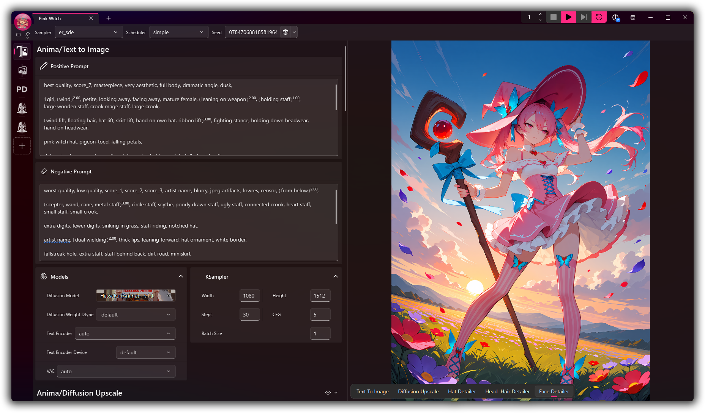
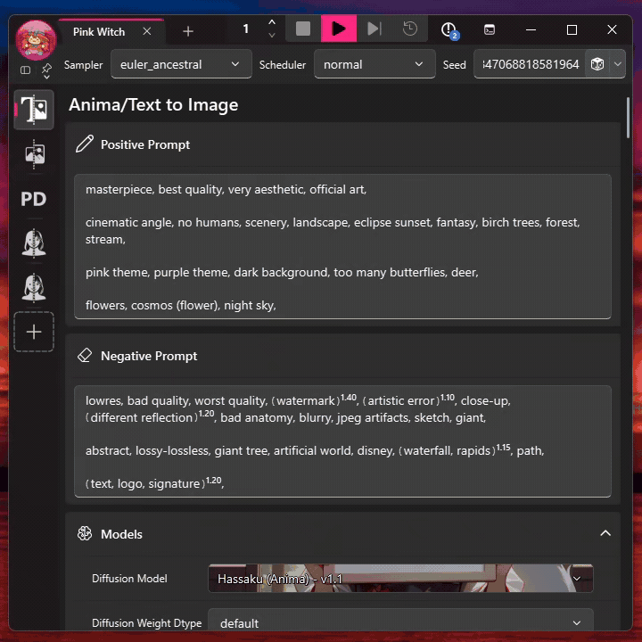
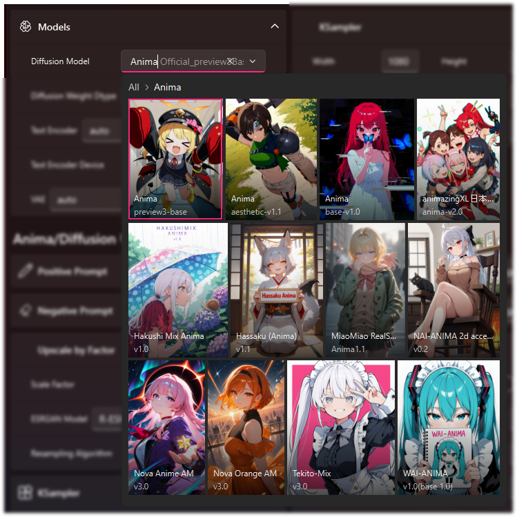
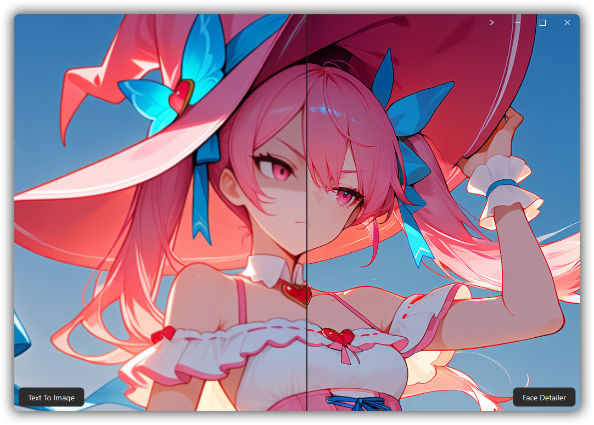

<p align="center">
  
</p>

<p align="center">
  <a href="https://github.com/Artificial-Sweetener/SugarSubstitute/releases"></a>
  <a href="https://github.com/Artificial-Sweetener/SugarSubstitute/actions/workflows/release.yml"></a>
  <a href="https://github.com/Artificial-Sweetener/SugarSubstitute/releases"></a>
  <a href="https://www.gnu.org/licenses/gpl-3.0.html"></a>
</p>

<p align="center">
  <strong>English</strong> | <a href="README.zh-Hans.md">简体中文</a> | <a href="README.ja.md">日本語</a> | <a href="README.ko.md">한국어</a>
</p>

**SugarSubstitute is the Qt front-end for [ComfyUI](https://github.com/Comfy-Org/ComfyUI) built for people who love what a graph can do and would rather not spend all day untangling one.**

I kept building the same workflow sections, switching them on and off, moving them around, and wiring them back together. Eventually I got fed up. Those sections became [**Cubes**](https://github.com/Artificial-Sweetener/SugarCubes), and the desktop app around them became SugarSubstitute.

**SugarSubstitute is in public beta.** Windows x64, Apple Silicon, and Linux x64 have dedicated installers.

**[Download the latest beta](#install-it)** for Windows x64, Apple Silicon, or Linux x64.

See the [roadmap](ROADMAP.md) for what I want to build next, and tell me what I'm missing.

<p align="center">
  
  <br>
  <em>The main workspace keeps the Cube stack, prompt, generation controls, and latest output in one place.</em>
</p>

## The short version

- **Stack workflow pieces, not loose nodes.** Add, reorder, mute, or remove Cubes while SugarSubstitute handles the links.
- **Stop waiting for WebUI support.** If ComfyUI can run a model, you can bring it into SugarSubstitute with a Cube. If you can build a ComfyUI graph, you can make one.
- **Update all of your workflows in one stroke.** Did you realize you should be doing upscaling differently, or a new inpainting technique came out? Update just the Cube with the affected segment and all of your Substitute workflows will fall in line.
- **Stop repeating yourself.** Change seeds, samplers, and other compatible settings once instead of hunting through the workflow.
- **A rich prompt editor purpose built for image gen.** Autocomplete, rich rendering, LoRAs, wildcards, emphasis, scenes, and draggable segments all live in one editor.
- **Browse models with your eyes.** Search thumbnails and metadata instead of spelunking through a filename dump.
- **Work beside the image.** Load, mask, generate, compare, and reopen results without bouncing between tools.
- **Share the whole recipe.** A recipe PNG can carry the workflow, prompts, settings, and enough evidence to recover missing models safely.

## See SugarSubstitute in motion

<p align="center">
  <a href="https://www.youtube.com/watch?v=wfamuJZCD2c">
    
  </a>
  <br>
  <em>Click the preview to watch the SugarSubstitute beta showcase on YouTube.</em>
</p>

## It is a beta. Please poke it.

SugarSubstitute is a public beta. I use it for real work, but I still expect rough edges. If setup fails, something crashes, or a normal task feels stranger than it should, please [open an issue](https://github.com/Artificial-Sweetener/SugarSubstitute/issues) with what you were doing and any diagnostics SugarSubstitute provides.

**Hardware coverage:** I develop and run inference with NVIDIA hardware. Managed setup also has paths for supported AMD and Intel GPUs, Apple MPS, and CPU-only inference on Windows, but I have not tested those hardware configurations myself. If you try one, tell me the exact hardware and operating system, whether setup completed, and whether generation worked. Successful reports matter too; silence and perfection look annoyingly similar from here.

## Install it

Setup can create a managed ComfyUI environment or connect to one you already use. Managed setup uses checksum-verified standalone Python environments and an in-process libgit2 client, so it does not require system Python or Git. The first run may take a while while the required pieces download. Let it cook.

**Already installed?** Open SugarSubstitute normally. It checks for application updates when it starts, usually once per day, and installs newer application versions automatically. You normally do not need to download another installer.

###  Windows x64

**[Download the latest Windows x64 installer](https://github.com/Artificial-Sweetener/SugarSubstitute/releases/latest/download/SugarSubstitute-Installer-Windows-x64.exe)**

Run the installer and choose a normal writable folder, such as `C:\SugarSubstitute`. Avoid Program Files because Windows permissions can interfere with setup and updates.

Managed setup supports NVIDIA through CUDA, supported AMD RDNA hardware through ROCm, Intel GPUs through XPU, and a CPU fallback. AMD acceleration on Windows is limited to the RDNA 3, RDNA 3.5, and RDNA 4 hardware families supported by the managed runtime. Other AMD hardware falls back to CPU rather than gambling on an incompatible environment.

Next: [choose how SugarSubstitute should use ComfyUI](#choose-your-comfyui-setup).

###  macOS Apple Silicon

**[Download the latest macOS Apple Silicon installer](https://github.com/Artificial-Sweetener/SugarSubstitute/releases/latest/download/SugarSubstitute-Installer-macOS-Apple-Silicon.dmg)**

Open the DMG, launch SugarSubstitute Setup, and use the default `~/Applications/SugarSubstitute` folder or another folder you own. Managed setup uses Apple's MPS acceleration on Apple Silicon. Intel Macs are not supported.

SugarSubstitute is ad-hoc signed but not notarized because this project does not participate in Apple's paid Developer Program. macOS will warn that it cannot verify the developer. If you downloaded the DMG from this repository, use macOS Privacy & Security settings to allow it to open.

I have only tested SugarSubstitute directly on Windows. The macOS package is built on Apple Silicon through GitHub Actions, but it still needs more people using it on real Macs.

Next: [choose how SugarSubstitute should use ComfyUI](#choose-your-comfyui-setup).

###  Linux x64

Choose the package that fits your system:

- **[Download the latest Linux x86_64 AppImage](https://github.com/Artificial-Sweetener/SugarSubstitute/releases/latest/download/SugarSubstitute-Installer-Linux-x86_64.AppImage)** for a portable installer. Mark it as executable, then run it.
- **[Download the latest Linux amd64 Debian package](https://github.com/Artificial-Sweetener/SugarSubstitute/releases/latest/download/SugarSubstitute-Installer-Linux-amd64.deb)** for Debian, Ubuntu, and related distributions. Install the package, then run `sugarsubstitute-setup`.

The default install folder is `~/.local/share/SugarSubstitute`. Managed setup supports NVIDIA through CUDA, AMD through ROCm, and Intel GPUs through XPU. A managed CPU-only Linux environment is not currently available.

I have only tested SugarSubstitute directly on Windows. The Linux packages are built on Linux through GitHub Actions, but they still need more people using them across real distributions and desktop environments.

Next: [choose how SugarSubstitute should use ComfyUI](#choose-your-comfyui-setup).

### From a Git clone

Use a source checkout when you want to run SugarSubstitute directly from the repository and make changes to it. This path requires Git and Python 3.12.

On Windows, open PowerShell and run:

```powershell
git clone https://github.com/Artificial-Sweetener/SugarSubstitute.git
Set-Location SugarSubstitute
py -3.12 -m venv .venv
.\.venv\Scripts\python.exe -m pip install --upgrade pip
.\.venv\Scripts\python.exe -m pip install -r requirements.txt pytest pytest-xdist ruff mypy pre-commit
.\.venv\Scripts\pre-commit.exe install
.\.venv\Scripts\python.exe main.py
```

On macOS or Linux, open a terminal and run:

```bash
git clone https://github.com/Artificial-Sweetener/SugarSubstitute.git
cd SugarSubstitute
python3.12 -m venv .venv
.venv/bin/python -m pip install --upgrade pip
.venv/bin/python -m pip install -r requirements.txt pytest pytest-xdist ruff mypy pre-commit
.venv/bin/pre-commit install
.venv/bin/python main.py
```

The first source launch opens the same setup flow as the packaged application. Let it create a managed ComfyUI environment or connect it to an existing one. After setup, use the final command again whenever you want to run your development checkout.

### Choose your ComfyUI setup

SugarSubstitute asks how it should use ComfyUI the first time it opens. You can change the connection later in Settings.

#### Let SugarSubstitute set up ComfyUI

This is the recommended option for most people. SugarSubstitute creates a separate local ComfyUI workspace, chooses the appropriate inference backend for your hardware, installs ComfyUI Manager and the required custom nodes, and starts and stops that copy with the application. It keeps the managed environment separate from any ComfyUI setup you already use. System Python and Git are not required.

Choose this when you want SugarSubstitute to own the complete ComfyUI environment and keep it ready.

#### Use your existing local ComfyUI

Choose the folder containing your existing ComfyUI `main.py`. SugarSubstitute keeps your repository and models in place, but prepares that ComfyUI environment for SugarSubstitute, including its Python dependencies, ComfyUI Manager, and required custom nodes. SugarSubstitute then launches this copy while the application is running.

Choose this when you want one local ComfyUI installation and are comfortable with SugarSubstitute preparing and launching it.

#### Connect to remote ComfyUI

Remote ComfyUI support has not been tested yet. SugarSubstitute saves the remote host and port, but it cannot install or repair anything on the remote machine. Keep the server reachable over a trusted LAN or VPN and avoid exposing ComfyUI directly to the public internet.

Install these custom nodes and their declared Python dependencies in the remote ComfyUI environment before connecting:

- [Substitute BackEnd](https://github.com/Artificial-Sweetener/Substitute-BackEnd)
- [SugarCubes](https://github.com/Artificial-Sweetener/SugarCubes)
- [ComfyUI Vectorscope CC](https://github.com/pamparamm/ComfyUI-vectorscope-cc)
- [ComfyUI SeedVR2 Video Upscaler](https://github.com/numz/ComfyUI-SeedVR2_VideoUpscaler)
- [SimpleSyrup](https://github.com/Artificial-Sweetener/SimpleSyrup)
- [ComfyUI Prompt Control](https://github.com/asagi4/comfyui-prompt-control)

Restart the remote ComfyUI server after installing the nodes, then enter its host and port in SugarSubstitute setup.

## Cubes, not cable spaghetti

A Cube is a versioned piece of a ComfyUI graph with declared inputs, outputs, and controls. Stack the ones you need and SugarSubstitute connects compatible endpoints. Reorder, mute, or remove one, and the links settle around the new stack without a session of tiny graph surgery.

Cube authors decide which native controls belong on the surface. Global overrides can gather compatible settings from several Cubes into one toolbar control, and you can still reveal the deeper controls when you need them.

Cube authors can publish their packs to GitHub, and users can subscribe to changes. When a Cube changes, pin the version you trust or update it while carrying compatible values and links forward.

## Stop waiting for your WebUI to catch up

SugarSubstitute gives ComfyUI a familiar, WebUI-style interface without making new model support wait for a frontend release. If ComfyUI can run it, SugarSubstitute can expose it through a Cube. Use an existing Cube or make your own. If you can build a ComfyUI graph, you can make a Cube. Model support arrives with the workflow, not when the UI catches up.

## Prompts should feel alive

The prompt editor understands the structure it displays. Autocomplete appears where you are typing, while emphasis, LoRAs, wildcards, punctuation, selection, and undo stay intact underneath. Comma-separated pieces can even be dragged across wrapped lines or moved with the keyboard.

<p align="center">
  
  <br>
  <em>A prompt editor that doesn't ask you to remember escapement rules and lets you make quick edits without taking your hand off your mouse.</em>
</p>

## Let the image remember

SugarSubstitute recipe PNGs carry both a readable Sugar recipe and the raw ComfyUI workflow. Open one to restore the Cube stack and versions, exposed values, global overrides, seed behavior, prompts, and supported sibling images from the same run.

...but you're used to that kind of convenience if you've been using Comfy or WebUI, so we do one better:

If a referenced model moved, SugarSubstitute searches your local library for the same SHA-256 and repairs the path. If the exact model is missing and CivitAI knows its hash, SugarSubstitute can offer a safety-checked download. Share results with your friends using Substitute and they'll be able to pull down whatever models they need to test it for themselves.

## Models with faces, not filenames

Compatible ComfyUI model fields become searchable visual pickers. Browse thumbnails and friendly names, search by filename or folder, follow model-load progress, open the matching CivitAI page, and use LoRA metadata to put trigger words straight into the prompt.

Drop a new model into the appropriate ComfyUI model folder and SugarSubstitute detects it automatically. It joins the picker without asking you to babysit the library.

<p align="center">
  
  <br>
  <em>The model picker turns a ComfyUI folder into a searchable visual grid, while models without artwork remain available beside the thumbnail-backed entries.</em>
</p>

Thumbnails and online metadata are optional. Provider access, API keys, and content policies stay under your control.

## Keep the image close

The native canvas gives source images, masks, previews, and final outputs a proper workspace. Zoom into the detail under the cursor, paint a mask or use Smart Select, compare results, and dock or float the canvas wherever it feels useful.

Substitute's canvas is built with [QPane](https://github.com/Artificial-Sweetener/QPane) and runs completely on your CPU because we both know your GPU has better things to do if you're genning. The canvas will never stutter just because you're running inference in the background.

<p align="center">
  
  <br>
  <em>Split view compares the original Text to Image result on the left with the Face Detailer pass on the right.</em>
</p>

## The small things are allowed to be nice too

The beta also has batch and continuous generation, a reorderable queue, live previews, output grids and comparisons, reusable control and prompt presets, multiple workflow tabs, Photoshop handoff, Danbooru tag tools, configurable output paths, Cube Pack management, ComfyUI diagnostics, and export back to ComfyUI workflow JSON.

That is a long list because little interruptions add up. I would like the application to get out of your way before you have to ask.

## License

SugarSubstitute is **Free and Open Source Software (FOSS)**, distributed under the **[GNU General Public License v3.0 or later](https://www.gnu.org/licenses/gpl-3.0.html)**.

## Acknowledgements

SugarSubstitute stands on an extraordinary amount of work from other people. I am genuinely grateful to all of them.

- **ComfyUI:** I owe an enormous thank-you to [comfyanonymous](https://github.com/comfyanonymous), [Comfy Org](https://github.com/Comfy-Org), and everyone who contributes to [ComfyUI](https://github.com/Comfy-Org/ComfyUI). ComfyUI is the engine and open workflow ecosystem that makes SugarSubstitute possible. Its flexibility is the reason I can build a different way to work without limiting what people can create.
- **ComfyUI Prompt Control:** I'm grateful to [asagi4](https://github.com/asagi4) and the contributors to [ComfyUI Prompt Control](https://github.com/asagi4/comfyui-prompt-control). They did the hard work behind advanced prompt editing and LoRA control in ComfyUI, giving SugarSubstitute powerful behavior to bring into its own editor.
- **PySide6-Fluent-Widgets and QFramelessWindow:** [zhiyiYo](https://github.com/zhiyiYo) and the contributors to [PySide6-Fluent-Widgets](https://github.com/zhiyiYo/PyQt-Fluent-Widgets) and [QFramelessWindow](https://github.com/zhiyiYo/PyQt-Frameless-Window) have put years of care into making Qt applications feel polished across platforms. SugarSubstitute feels more like a real desktop application because that work was there to build on.
- **CivitAI:** I'm grateful to the [CivitAI](https://civitai.com/) team for treating the model ecosystem like something worth supporting. Their API helps SugarSubstitute connect models with the information people need to use them, their permissive hosting gives creators room to share, and their affordable on-demand compute helps more people make things without owning an expensive GPU.
- **Danbooru:** The [Danbooru](https://danbooru.donmai.us/) team and community have built an unusually thoughtful shared language for describing images. Their API makes that knowledge useful inside SugarSubstitute, but the real gift is the care people continue to put into organizing, documenting, and refining the tags themselves.
- **Qt:** Finally, thank you to [The Qt Company](https://www.qt.io/) for Qt and PySide6. They make it possible for me to build the responsive, native, cross-platform creative application I wanted SugarSubstitute to be.

## From the Developer 💖

I built SugarSubstitute because I wanted ComfyUI's power to feel like a place I could actually live in. I hope it leaves you with less time tending wires and more time making strange, lovely things.

- **Buy Me a Coffee**: You can help fuel more projects like this at my [Ko-fi page](https://ko-fi.com/artificial_sweetener).
- **My Website & Socials**: See my art, poetry, and other dev updates at [artificialsweetener.ai](https://artificialsweetener.ai).
- **If you like this project**, it would mean a lot to me if you gave me a star here on GitHub!! ⭐
