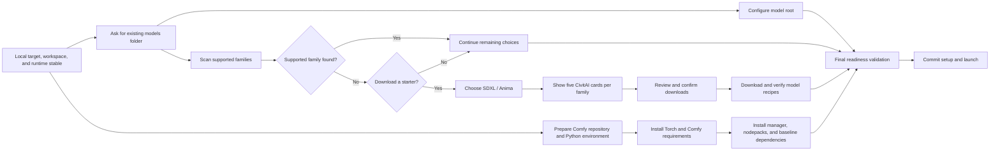

# ComfyUI Model Onboarding Remediation Work Ledger

Status: remediation complete; exact-tree verification passed; ready for maintainer smoke

Research snapshot: 2026-09-04

Scope: first-run local ComfyUI setup, CivitAI recommendations, model acquisition, and setup progress

Historical origin: `220de1b41eb55ad87243cd2e1a029d2bbeb50b5a` (`feat(setup): deliver repair and guided model onboarding`, 2026-08-31)

## Outcome

Move model onboarding out of the bootstrap-launcher stage and into the application-owned ComfyUI-setup stage of the same installation experience. Present choices that describe what users can create with: supported model families, initially SDXL and Anima. When a local setup has no detected model from a supported family, offer an optional starter-model flow that shows five safe, popularity-ranked CivitAI models with real thumbnails for each selected family.

Start the slow, choice-independent parts of managed ComfyUI provisioning as soon as the workspace and runtime choices are stable. Let that work continue while the user chooses a model folder, families, models, and integrations. The normal setup surface shows semantic progress bars and concise status. Raw console output stays collapsed unless the user requests it or setup fails. Completion, failure, and required intervention request operating-system attention without stealing focus.

This is a clean replacement of the current launcher-stage onboarding, not an extension of it.

### Installation-experience boundary

For this product, **installation** is the complete first-run journey from the bootstrap launcher through application-owned ComfyUI setup and final readiness. The standalone launcher is one stage of that journey; it is not the boundary of the installer. Moving model choices into ComfyUI setup corrects their ownership without moving them outside installation.

The current installer checker encodes the same incorrect boundary as the misplaced model flow: it exercises the bootstrap launcher but does not cover application-owned ComfyUI setup. That prevents meaningful end-to-end UX review without repeating real installation and provisioning work.

Remediation therefore begins with a two-mode install-experience harness:

- **Headless/offscreen qualification** is the normal development and regression path. It deterministically drives production UI and simulated external boundaries without showing windows, installing software, using the network, or mutating the user’s machine.
- **Interactive no-install walkthrough** is an explicitly launched maintainer QA mode. It presents the complete production install journey with controlled scenarios so final copy, sequencing, layout, progress, error, and completion behavior can be reviewed without performing a real install.

Interactive visual smoke is not a continuous development gate and must never open in front of the maintainer unless explicitly requested. Headless tests remain mandatory and provide the continuous verification layer.

## Binding product contract

### First-run local journey

1. The user finishes selecting the local ComfyUI target, workspace, and hardware/runtime policy.
2. SugarSubstitute starts every safe, choice-independent ComfyUI preparation task in the background.
3. SugarSubstitute asks: **Do you have an existing models folder?** The choices are **Yes** and **No**.
4. **Yes** advances to the next page, where SugarSubstitute shows the existing-models folder field and Browse action inline, using the same interaction pattern as the output-folder picker. Answering Yes does not open a native dialog. After the user supplies the root, SugarSubstitute validates it, configures it as the ComfyUI model root, and scans it without modifying its contents.
5. **No** keeps the managed default model root.
6. For a selected existing root, SugarSubstitute attempts to identify installed models from the currently supported families: **SDXL** and **Anima**. Anima is the exact model-family name; it is not a synonym for anime.
7. If at least one supported family is confidently detected, setup continues without forcing a starter-model offer. The detected-family summary remains visible and no model is downloaded automatically.
8. If no supported family is detected, or the user said they have no existing folder, SugarSubstitute asks whether they want to download a model to get started.
9. **No** continues setup without models.
10. **Yes** clearly states that recommendations and selected downloads come from CivitAI, then asks which supported model families interest the user. This is a multi-select choice containing **SDXL** and **Anima** in the initial release.
11. SugarSubstitute shows one recommendation page per selected family in catalog order: SDXL first, then Anima. Each page shows up to five unique CivitAI models in CivitAI popularity order, with a safe thumbnail, creator, version, family, file size, popularity rank, and link to the model page.
12. Cards start unselected. The user explicitly selects the exact files to download and sees the aggregate transfer size and destination before confirming.
13. Confirmed model downloads join the setup task graph. The final waiting surface shows exact byte progress for model transfers and calibrated phase progress for ComfyUI provisioning.
14. Setup commits and launches only after every required setup task and every explicitly selected download has succeeded. The window requests attention when setup completes, fails, or requires action while inactive.

### Route boundaries

- **Managed local:** full journey and early background provisioning.
- **Attached local:** existing-folder detection and recommendations are available when SugarSubstitute can configure the attached ComfyUI model root. Attached setup work may run in the background under the same task contract.
- **Remote:** do not show a local directory picker or download files to the local machine on behalf of a remote ComfyUI instance. Skip local model acquisition until a remote model-management backend exists.
- **Repair and reconfigure:** preserve the configured model root and do not replay first-run recommendations automatically. A separately invoked “find models” action may reuse recommendation components later, but it is not part of this remediation.

### Ranking policy for the first release

“Popular” means the order returned by CivitAI for `sort=Most Downloaded` and `period=Month`. Keep that wording in the UI; do not call the list “highest rated.” Preserve provider order and show rank rather than presenting an all-time download count as a monthly count. The ranking policy belongs to configuration so a later switch to `Highest Rated`, another period, or a blended score does not require a presentation rewrite.

## Research baseline before remediation

This section records the product state observed at the 2026-09-04 research snapshot. It is historical evidence for the divergence and remediation decisions below; it does not describe the remediated tree.

### Standalone launcher flow

The production launcher always injects `build_installer_model_onboarding()` into `LauncherMainWindow`. After the launcher installs the SugarSubstitute payload/runtime, `LauncherMainWindow._offer_model_onboarding()` assumes the model root is `<install root>/comfyui/models` and pauses the normal setup/handoff path while the model controller runs.

`ManagedComfyModelFolders` and `ModelDiscoveryPlanner` then:

1. Hard-code six ComfyUI storage/artifact categories: checkpoints, diffusion models, LoRAs, VAEs, ControlNet models, and upscalers.
2. Scan corresponding folders for broad file extensions.
3. Suppress the entire offer when any compatible file exists in any supported category.
4. Ask the user which technical categories interest them.
5. Query CivitAI by artifact `types`, using `Most Downloaded` over `Month`.
6. Fetch thirty candidates and retain three cards per category.
7. Download explicitly checked files into category-derived folders.
8. Resume launcher setup/handoff after skip or completion.

The launcher-facing choices are currently:

- Checkpoint models
- Diffusion models
- LoRA styles and characters
- VAE color and decoding models
- ControlNet guidance models
- Upscaling models

These are implementation and storage concepts, not the supported fine-tune families the user is choosing between.

Although `DiscoveredModel` contains `thumbnail_url`, `ModelCardWidget` does not load it. It creates a fixed-height label containing the category name. The in-application empty-picker modal also renders metadata-only cards without thumbnails.

The launcher acquisition executor reports only succeeded, failed, and finished. `ModelAcquisitionService` already calculates exact received/expected byte progress, but `ModelOnboardingService` and the launcher execution bridge do not surface it to the UI.

### Application-owned ComfyUI setup

The in-app onboarding flow already owns the decisions the launcher guessed:

- managed, attached, or remote target;
- managed/attached workspace path;
- hardware, Python, Torch, and ComfyUI policy;
- model root and output root;
- CivitAI metadata, download, thumbnail, and API-key preferences;
- the setup transaction, readiness verification, launch, and completion.

Its current local page order is target configuration, folders, integrations, provisioning, completion. `FolderSetupPage` exposes a generic editable “Models folder” field immediately. It does not ask the Yes/No question or inspect model families.

`OnboardingController.start_provisioning()` is first called when the UI reaches the provisioning page. It submits one end-to-end `OnboardingFlowService.provision()` job after folder and integration choices are complete. The managed path performs preference persistence, runtime selection, repository/environment preparation, Torch and requirements installation, ComfyUI-Manager provisioning, nodepack installation, model-root configuration, Base-Cubes preparation, validation, transaction commit, and launch in that one job.

Progress is a pair of string callbacks: `status` and `log`. `ProvisioningPage` always shows a 320–390-pixel live terminal. It has no progress bar, and `mark_complete()`, `mark_failed()`, and `reset_progress()` currently have no visual behavior. Failures are projected inline instead of using the existing structured `ErrorReportDialog` with copyable report text.

### Existing capabilities that are adjacent, not a basis for the old flow

The launcher model-onboarding controller, pages, eligibility rule, and technical-category planner should be removed. Independent infrastructure can be used by the replacement only after its ownership and names are corrected:

- `ModelAcquisitionService` already performs bounded HTTPS transfer, destination validation, collision-safe side-by-side placement, declared-size validation, SHA-256 verification, cancellation, atomic promotion, and partial-file cleanup.
- The application CivitAI metadata subsystem already has richer model/version/image parsing, thumbnail safety policy, Qt thumbnail preparation, and the registered `model-thumbnails` persistent cache.
- `ErrorPresenter` and `ErrorReportDialog` already provide the product’s structured modal and copy-report path.
- `request_window_attention_if_inactive()` already uses Qt’s cross-platform attention request without focus stealing.
- Managed setup already emits stable phase statuses, trace spans, exact standalone artifact download progress, native extraction percentages, and directory-copy progress. Several of those structured signals are currently flattened into log strings before reaching onboarding.
- `model_family_resolver.py` already recognizes Anima and SDXL metadata, but it is coupled to post-startup catalog items and is not an existing-folder scanner.
- SimpleSyrup’s `Simple Load Anima` contract confirms that an Anima starter is a diffusion model plus auto-resolved Qwen text-encoder and VAE assets. The onboarding install recipe must account for the complete runnable set rather than downloading only a main file and leaving another opaque wait for first use.

## Divergence from the intended product

| Concern | Current behavior | Required behavior |
| --- | --- | --- |
| Feature owner | Standalone launcher, before the real ComfyUI decisions | In-app ComfyUI setup, after target/runtime choices are known |
| Model root | Guessed as `<install root>/comfyui/models` | Explicit default or user-selected local model root owned by onboarding |
| First question | Technical model interests | “Do you have an existing models folder?” Yes/No |
| Detection | Counts files by storage folder and extension | Identifies supported model families with confidence and reports unknowns safely |
| User vocabulary | Checkpoint, diffusion model, LoRA, VAE, ControlNet, upscaler | SDXL and Anima model families; later Flux.2 and orthogonal style preferences |
| Eligibility | Any file in any technical category suppresses all onboarding | Offer a starter when no supported family is confidently present |
| CivitAI filter | Artifact `types` only | Exact family through `baseModels`, with artifact type retained as hidden install policy |
| Results | Three per technical category | Up to five unique, eligible models per selected family |
| Thumbnails | URL parsed but discarded by both card UIs | Safe real thumbnail on every presented recommendation card |
| Popularity | Monthly provider order, weakly communicated | Explicit “popular this month,” provider order preserved, visible rank |
| Provisioning timing | Begins after all setup questions | Choice-independent preparation starts as soon as runtime/workspace inputs are stable |
| Setup progress | Status string plus always-visible console | Semantic phase bar; exact byte bars where available; log collapsed by default |
| Download progress | Computed below the UI boundary but dropped | Per-file and aggregate byte progress through the shared setup task projection |
| Failure UX | Inline onboarding failure | Unified error modal, sanitized copyable report, recovery actions, expandable log |
| Completion UX | No onboarding attention contract | Cross-platform attention request when the inactive window finishes or needs action |
| Extensibility | Enum values are ComfyUI directories | Data-driven family catalog plus independent style facets and provider mappings |

## Root causes to remove

1. **Authority inversion.** The launcher decides about ComfyUI models before the application’s ComfyUI setup owns a target, workspace, and model root.
2. **Taxonomy conflation.** `ModelCategory` currently means a ComfyUI artifact/storage kind. A user-facing recommendation category, a model family, a style preference, and an install destination are separate concepts.
3. **Over-broad eligibility.** One unrelated compatible artifact suppresses the whole onboarding offer.
4. **Provider filtering at the wrong dimension.** CivitAI model type is treated as the recommendation choice while `baseModels`—the field that represents SDXL or Anima—is not used.
5. **A discarded presentation field.** Thumbnail URLs are parsed but never rendered.
6. **Serial orchestration.** A single final provisioning call combines work whose prerequisites become available at different times.
7. **A text-only progress boundary.** Infrastructure detail is flattened before presentation can build honest progress.
8. **Entangled reuse.** The same planner and technical enum drive launcher onboarding, empty-picker recovery, and model updates even though those use cases have different intent and change cadence.
9. **Known architecture debt in the insertion point.** `flow_service.py`, `onboarding_controller.py`, `onboarding_pages.py`, and `onboarding_window.py` already have remediation waivers for mixed responsibilities. Adding the feature directly to them would deepen recorded debt.
10. **An incomplete installer test boundary.** The current installer checker stops at the bootstrap launcher even though installation continues through ComfyUI setup. Maintainer UX review therefore requires repeating real provisioning, while the complete journey lacks one deterministic qualification boundary.

## Target ownership and domain language

### Separate the three axes

- `ModelArtifactKind`: checkpoint, diffusion model, LoRA, VAE, ControlNet, upscaler. This is an infrastructure/cube compatibility and destination concept. Migrate every current technical use of `ModelCategory` to this type.
- `ModelFamily`: SDXL, Anima, and future Flux.2. This is the exact generation-family identity used for detection and compatibility.
- `ModelStylePreference`: realism, illustration, anime style, and future preference facets. This is orthogonal to family and is not part of the first release’s questions.
- `ModelCategory`, if retained: a product-facing recommendation lane composed from a family and optional preference filters. It must never again mean a ComfyUI directory name.

The research snapshot found 187 `ModelCategory` references across 27 production/test files. The migration must be complete and internal; do not leave aliases or forwarding compatibility shims.

### Authoritative owners

| Owner | Responsibility |
| --- | --- |
| Supported model family catalog | Stable family ID, localized label/description, CivitAI base-model values, recommendation order, supported artifact/file roles, install recipe, and local detection policy |
| Existing model family scanner | Read-only bounded traversal, evidence extraction, confidence, cancellation, and diagnostics |
| CivitAI recommendation gateway | Live enum validation, family queries, pagination, safe result parsing, provider-order retention, and retryable failures |
| Recommendation planner | Apply selected families and later style facets, exclude installed exact files, require unique eligible cards, and cap each page at five |
| Model install recipe resolver | Map a selected provider file to a safe ComfyUI destination and include required family auxiliaries |
| Setup task coordinator | Dependency graph, cancellation/invalidation, retry/resume, resource scheduling, final barrier, and transaction state |
| Setup progress projector | Convert typed task progress into one monotonic user-facing aggregate without inventing precision |
| Onboarding presentation | Render questions, scans, family pages, thumbnails, review, progress, logs, errors, and completion; contain no provider or filesystem rules |

The family catalog is authoritative application state, not a cache. Provider responses may be process-lifetime data. Persisted recommendation or thumbnail data must use the existing prepared cache catalog; no component may construct a cache path directly.

## Target CivitAI contract

CivitAI’s official [models reference](https://github.com/civitai/civitai-developer-docs/blob/main/site/reference/models.md) exposes the needed distinction: `types` filters artifact kind and `baseModels` filters the base family. It supports `Most Downloaded`/`Highest Rated`, time periods, `nsfw`, `earlyAccess`, and `primaryFileOnly`; anonymous callers receive published public versions. The public [enums endpoint](https://github.com/civitai/civitai-developer-docs/blob/main/site/reference/enums.md) is the runtime authority for valid provider enum strings and explicitly warns clients not to bake the provider’s entire changing enum inventory into code.

Initial family mappings:

| Product family | CivitAI `baseModels` | Parent `types` | Primary destination policy |
| --- | --- | --- | --- |
| SDXL | `SDXL 1.0` | `Checkpoint` | Accept only a complete supported SafeTensor checkpoint recipe; normally `checkpoints` |
| Anima | `Anima` | `Checkpoint` | Anima diffusion file in `diffusion_models`, plus trusted Qwen text-encoder and VAE auxiliaries |

On 2026-09-04, a live `GET /api/v1/enums` check contained both `SDXL 1.0` and `Anima` in `BaseModel` and `ActiveBaseModel`. Live monthly-popularity queries returned populated checkpoint results for both mappings. This is validation evidence, not a list to freeze; recommendation content remains live.

Each family query uses:

```text
GET /api/v1/models
  ?types=Checkpoint
  &baseModels=<exact configured provider value>
  &sort=Most Downloaded
  &period=Month
  &nsfw=false
  &earlyAccess=false
  &primaryFileOnly=true
```

Fetch enough provider-ranked candidates to produce five eligible cards, using bounded cursor pagination up to 100 inspected model records per family. Preserve model-item order. Produce at most one card per CivitAI model, choosing the first published compatible version with an eligible primary file. Do not fill a family page with multiple versions of one model.

A recommendation is eligible only when all of the following hold:

- exact configured `baseModel` match for the selected product family;
- expected parent model type and supported file role for that family recipe;
- public, published, unmoderated availability;
- SafeTensor file with a valid filename, positive declared size, SHA-256, HTTPS CivitAI download URL, and successful provider pickle/virus scan metadata;
- no duplicate model, version, or SHA-256;
- no exact local hash already present;
- a safe decodable thumbnail is available under the active onboarding SFW policy.

Use images already returned with the selected model version first. If a top candidate lacks an eligible image, make a bounded fallback request to CivitAI’s public [images endpoint](https://github.com/civitai/civitai-developer-docs/blob/main/site/reference/images.md) with `modelVersionId`, a small explicit limit, and safe browsing filters. Skip a candidate if no safe thumbnail can be obtained, then continue down provider order. If fewer than five eligible thumbnail-complete models exist after the bounded search, show the smaller honest result set and explain why; never weaken safety to fill the grid.

The public list and image requests do not require a token. If a selected file requires authentication, use the existing credential store and the `Authorization` header. CivitAI’s [authentication guidance](https://github.com/civitai/civitai-developer-docs/blob/main/site/guide/authentication.md) prefers the header because query tokens leak into logs and caches. Never include credentials in URLs, progress events, or copied reports.

## Setup task and progress contract

### Task graph



Start `B` immediately after the user leaves the managed-local runtime page with valid stable choices. Begin a pending setup transaction before mutating the managed workspace. Do not write active configuration or commit until the final barrier passes.

Changing an input invalidates only dependent tasks:

- changing workspace, runtime, Comfy channel, or hardware policy cancels/replans the managed preparation branch;
- changing the model root cancels/replans the scan, root configuration, and any not-yet-confirmed acquisition plan;
- changing selected families cancels stale discovery requests;
- changing selected cards before final confirmation recalculates the acquisition plan without deleting user files;
- closing onboarding cancels owned work where safe and leaves transaction evidence sufficient for existing repair/resume behavior.

Use the host execution scheduler’s resource model. Repository/runtime artifacts and multi-gigabyte models should not blindly saturate the same disk/network concurrently. Allow CPU-only scanning and user interaction to continue; serialize or capacity-limit bandwidth-heavy transfers according to measured contention.

### Typed progress events

Replace the onboarding-only `Literal["status", "log"]` event with a domain/application progress contract containing at least:

- setup transaction and task identity;
- task/phase ID and localized presentation text;
- queued, running, completed, failed, cancelled, or skipped state;
- completed and total units when the owner has real units;
- unit kind: bytes, items, percent, or indeterminate;
- optional current item label and recoverable diagnostic reference;
- monotonic timestamp for ordering and stale-generation rejection.

Keep raw log lines on a separate diagnostic stream. Infrastructure owners should emit typed starts, completions, and known-unit progress directly. Parse subprocess output only where the external tool is the sole source of finer progress.

### Honest aggregate progress

- Model and standalone artifact downloads use exact received bytes over expected bytes.
- Native extraction and managed-package copying use their existing real percentage/item callbacks.
- Discrete stages such as repository sync, virtualenv creation, Torch installation, requirements, manager, nodepacks, configuration, and validation contribute calibrated phase weights.
- An active phase with no trustworthy internal units is indeterminate within its reserved range. The overall bar never runs backward and never reaches 100% before the final barrier succeeds.
- Capture representative clean and warm-cache runs on Windows, Linux, and macOS for supported runtime strategies. Record timestamped phase boundaries, classify stable landmarks, and derive versioned progress profiles from measured median phase shares. Keep transcript fixtures for the parser. Do not place guessed percentages in production.
- A changed or unrecognized external-output format falls back to phase-level indeterminate progress and logs a structured diagnostic; it must not fail setup.

## Chronological execution ledger

The order below is intentional. Each entry leaves the tree in a coherent state and has an observable exit condition. Check an entry only when its exit evidence exists in the same change.

### WL-000 — Preserve the research baseline

State: **complete**

Evidence recorded in this document:

- exact launcher and in-app flow traces;
- historical introduction commit;
- current provider API contract and live family validation;
- shared-type blast radius;
- existing acquisition, thumbnail, error, attention, transaction, and progress capabilities;
- architecture-debt constraints.

### WL-005 — Establish complete install-experience qualification

State: **complete**

Depends on: WL-000

Replace the current launcher-only meaning of “installer check” with a harness that covers the complete installation experience: bootstrap launcher, application-owned ComfyUI setup, and final ready handoff. Reuse the production launcher and onboarding presentation rather than maintaining a parallel mock UI.

Provide two deliberate execution modes over the same scenario model:

- a default headless/offscreen mode for automated development and regression tests;
- an interactive mode that opens only when a maintainer explicitly requests a no-install UX walkthrough.

The harness must substitute only external and side-effecting boundaries. Supply deterministic scenarios for launcher progress and handoff; managed, attached, and remote routes; existing-folder selection; SDXL, Anima, mixed, empty, unknown, and failed scans; starter-model choices; ordered CivitAI results and thumbnails; fewer-than-five and provider failures; background provisioning landmarks; model-download progress, retry, and cancellation; structured errors; completion; and inactive-window attention.

Neither mode may perform a real installation, create a ComfyUI environment, invoke provisioning subprocesses, modify user configuration, read credentials, or write outside a disposable qualification directory. Headless runs use deterministic offline CivitAI fixtures and may capture controlled rendering artifacts without presenting windows. The explicitly requested interactive walkthrough uses the real read-only CivitAI discovery and thumbnail boundaries so the maintainer can judge current names, metadata, ranking, images, and links; installation, persistence, and model-transfer effects remain simulated. The interactive mode must support both the full journey and direct entry into the ComfyUI-setup stage for focused final QA.

Development and continuous verification use the headless mode. The interactive mode is not an always-running smoke gate, must not launch as a side effect of tests, and is reserved for explicit maintainer review of presentation and interaction.

Exit evidence: one headless command deterministically covers the complete install journey with zero external side effects; one separate explicit command opens the same production journey for no-install maintainer QA; direct ComfyUI-setup entry works; tests prove the interactive window is never launched by ordinary or CI qualification.

Implemented evidence:

- `python -m tools.installer_experience_smoke` captures the production bootstrap-launcher matrix plus managed, attached, and remote application-owned ComfyUI setup routes using deterministic synthetic boundaries.
- `python -m tools.installer_experience_smoke --interactive --surface full` explicitly opens the production launcher and hands its completed synthetic workflow into production ComfyUI setup without materializing the selected installation root.
- `python -m tools.installer_experience_smoke --interactive --surface comfy-setup` explicitly opens application-owned ComfyUI setup directly.
- Interactive ComfyUI setup composes the production CivitAI family gateway and transient in-memory thumbnail preparation. Headless qualification keeps deterministic offline fixtures. Neither path performs model downloads or setup writes.
- The full journey locks the installation root at launcher handoff, so application-owned ComfyUI setup begins at “Pick a setup.” Direct ComfyUI-setup entry remains unlocked and includes the installation-root page because no launcher precedes it.
- Focused tests prove the default command remains headless, both production windows participate, the full synthetic handoff does not create the installation root, the exact visible installation-root question occurs once across the real-window handoff, screenshots are captured offscreen, protected sentinels remain unchanged, and every forbidden side-effect counter remains zero.

### WL-006 — Prevent duplicate decisions at the qualification handoff

State: **complete**

Depends on: WL-005

The first maintainer walkthrough exposed a qualification fidelity defect: the synthetic launcher selected the installation root, then opened application-owned ComfyUI setup with that root marked editable. The second window therefore presented “Choose where Substitute should keep its setup” again. The headless driver had the same unlocked entry but labeled and auto-advanced that page as a generic welcome checkpoint, so its evidence did not disclose the duplicate.

Keep entry context explicit. A complete launcher-to-setup journey passes a locked installation root into ComfyUI setup and enters at target-mode selection. A direct ComfyUI-setup walkthrough passes an unlocked root and retains the location decision as its first page.

Exit evidence: an integration test drives the production launcher through its inert workflow into the production onboarding window, counts the exact visible location question once across both windows, and asserts that the handed-off window opens on `OnboardingTargetModePage`. The default headless smoke fails if any ComfyUI route exposes `OnboardingWelcomePage` after launcher handoff or begins on any page other than target mode; its evidence records the launcher as the sole installation-root decision owner.

### WL-007 — Remediate the failed post-check presentation

State: **complete**

Depends on: WL-005, WL-006

The first maintainer smoke after the earlier “checked” report exposed failures that the qualification evidence had not actually ruled out. These reports are binding regression cases:

- “The first page is broken. I have no idea why you would do that.” and “You changed the layoutt. It was not authorized.” Source: `codex-clipboard-60fad395-2462-4425-b1a1-17da5d0e4425.png`. The launcher install-location content had been allowed to occupy a changed vertical layout. Restore the existing composition and prevent the removal of misplaced model onboarding from redesigning this page.
- “Using radio buttons for ‘do you have an existing models folder’ is inappropriate.” Source: `codex-clipboard-2a59698b-b268-4859-b9b1-a66719d9e7e2.png`. Both binary questions must use the same compact, explicit Yes/No push-button control with a visible selected state. They must not use radio controls or a full-width decorative wrapper.
- “You also made it pop up the file picker rightt away which is also inappropriate.” and “I said have it ask, tthen in the next page if they answered yes, we show the picker” and “Just like how the outputt folder picker is.” Selection on the question page must only record the answer and enable Continue. The next page owns the inline field and Browse button; only pressing Browse may open the native picker.
- “When selectting ‘no’”. Source: `codex-clipboard-9b4192ba-e6da-4e76-833d-9fb75156defe.png`. The No route left an empty model-section frame above the output folder. Hide the whole section, not only its child field, reflow the page, and use output-only explanatory copy.
- Source: `codex-clipboard-aa0ef303-f5cc-448c-96fc-ac71407ad00a.png`. The starter-model question still used radio buttons inside an oversized wrapper. It must use the same shared compact Yes/No control as the existing-folder question.
- “I have waited almost an hour for you to fix this and it's not fixed.” Sources: `codex-clipboard-58eaa581-08d2-4462-aa84-cbd373b50f1b.png` and `codex-clipboard-6b263a0d-2080-43e1-8653-8d58746636c8.png`. Replacing radio buttons was insufficient because the shared push buttons retained a 140-logical-pixel minimum width, which became roughly 245 physical pixels at the maintainer's display scale. Both questions must use the same fixed 76-logical-pixel button width and must be rendered at 175% DPI before this regression is considered closed.
- “SYNTTHETIC SHOULD STILL PULL FROM CIVIT.. HOW AM I SUPPOSED TO JUDGE THE FUCKING FLOW IF REAL CIVITT TTHUMBS DON'T GET PULLED AND REAL METADAT IS NOTT SHOWN?” Sources: `codex-clipboard-9e287af4-db27-4361-806c-0fa2059c782d.png`, `codex-clipboard-2090a758-7f72-496c-85e3-d6ff92b1ad21.png`, and `codex-clipboard-60e6788e-3ce0-44b5-a4c7-ce7c8d43a303.png`. Colored placeholders and invented names cannot qualify the maintainer-facing interactive flow. That flow must retrieve live read-only CivitAI results and real thumbnails; deterministic fake cards belong only to automated headless coverage.
- “Finally this is broken.” Source: `codex-clipboard-ecd7d49e-3426-4c29-84d4-a8a2fcd9af70.png`. The setup page simultaneously said all tasks were complete and that a model was still downloading, while clipping the setup-log control. Completion must route directly to the completion page; a finished transfer must not retain active-download wording; dynamic progress content must recompute page height so every control remains visible.

Implemented evidence: launcher geometry is protected by a focused centering/layout regression; both questions use one `OnboardingBinaryChoice` owner with 76-logical-pixel-wide exclusive push buttons and a check-mark selected state; answering has no picker side effect; the Yes page presents an empty existing-model field plus Browse in the same field-block pattern as output; the No page contains only the output section; the interactive composition uses live CivitAI discovery and transient in-memory thumbnails; and provisioning owns one coherent typed progress projection with direct completion routing and dynamic-height signals. The Windows high-DPI offscreen capture now respects device-pixel ratio, produces an opaque readable dark image, and fails if rendering does not reach the footer region.

Exit evidence: focused interaction and geometry tests pass; fresh 175% DPI dark-theme captures show compact 76-logical-pixel buttons on both binary questions, and the broader 150% capture shows the selected state, separate Yes picker page, reflowed No page, and unclipped failure/log controls; live read-only qualification returns five thumbnail-complete current CivitAI cards for both SDXL and Anima, replenishing an unavailable thumbnail from the next provider-ranked candidate.

### WL-010 — Characterize behavior before structural changes

State: **complete**

Depends on: WL-005

Add or tighten regression tests around the boundaries being changed:

- launcher installation completes and hands off with and without the current onboarding controller;
- current setup transaction begin/fail/resume/commit behavior;
- managed, attached, and remote onboarding page routes;
- model-root default/custom persistence and backend configuration;
- empty-picker discovery and model-update behavior, because both currently share the technical category type;
- acquisition integrity, cancellation, collision, and cleanup behavior;
- ErrorReport copy/open-console behavior and inactive-window attention.

Exit evidence: focused characterization tests pass against the pre-refactor behavior. Tests describing the intentionally wrong launcher UX may be replaced later; tests protecting independent safety and update behavior remain.

Implemented evidence: 226 focused characterization tests pass across launcher installation/handoff/model coordination; managed, attached, and remote onboarding presentation; setup transactions and flow state; model-root persistence; model discovery, acquisition, and updates; empty-picker recovery; structured error reporting; and inactive-window attention consumers. These tests establish the safety boundary before the approved flow and ownership changes begin.

### WL-020 — Remove model onboarding from the standalone launcher

State: **complete**

Depends on: WL-010

Remove production composition, state, pages, controller, executor, styles, strings, and tests whose only responsibility is launcher model onboarding:

- stop injecting `model_onboarding_service_factory` in `launcher/sugarsubstitute_launcher/app.py`;
- remove `_offer_model_onboarding()` and its handoff blocking from `LauncherMainWindow`;
- delete launcher-specific model onboarding composition/controller/execution and the interest/gallery portions of `experience_pages.py`;
- remove corresponding launcher translation entries and regenerate every release catalog;
- replace coordination tests with assertions that model discovery/download can never delay the launcher’s application handoff.

Do not remove repair, application install, or handoff behavior introduced by the same historical commit.

Exit evidence: repository search finds no launcher dependency on model discovery/acquisition; a fresh launcher install hands off directly to application-owned ComfyUI setup; launcher tests prove it.

Implemented evidence: launcher composition, `LauncherMainWindow`, installer qualification, installer view state, and translations contain no model discovery or acquisition dependency. The launcher-only model application service, controller, execution worker, pages, presentation types, tests, and crash-boundary inventory entry are removed. The no-install full-experience test drives the production launcher through its synthetic workflow and observes its direct handoff into application-owned ComfyUI setup without materializing an install root. Focused launcher, localization, harness, lint, strict typing, and architecture checks pass.

### WL-030 — Correct the model taxonomy and disentangle consumers

State: **complete**

Depends on: WL-020

Introduce `ModelArtifactKind` and migrate every current technical `ModelCategory` use across cube capabilities, backend inventory, empty-picker recovery, acquisition destinations, usage recording, updates, persistence, and tests. Migrate serialized internal values atomically where persistence exists; preserve public/host-facing compatibility only where it is actually public.

Separate the empty-picker planner from onboarding recommendations. Empty-picker recovery answers “this field needs an artifact of kind X”; onboarding answers “which supported family do you want to create with?” They may share safe provider transport and acquisition primitives, but not a planner or eligibility rule.

After all call sites move, remove the old technical `ModelCategory`. Introduce the new family/style/recommendation types under their actual owners. Do not leave an alias.

Exit evidence: no technical folder or cube contract uses `ModelCategory`; empty-picker and update behavior tests remain green; architecture and strict typing pass for the migration.

Implemented evidence: every technical storage/file role now uses `ModelArtifactKind`; installer-only cube capability and eligibility contracts are removed; empty-picker discovery has its own planner and service; and no internal aliases or forwarding shims preserve the discarded onboarding abstraction. Authoritative model-usage schema version 1 remains readable and is atomically rewritten as version 2 with `artifact_kind` on its next save. Thirty-five focused discovery, acquisition, update, persistence, controller, lint, and strict-typing checks pass.

### WL-040 — Pay down the onboarding ownership debt before adding pages

State: **complete**

Depends on: WL-030

Perform the extractions already required by `SS-ARCH-016`, `SS-ARCH-066`, `SS-ARCH-067`, and `SS-ARCH-068`:

- extract preference application and runtime launch from setup transaction orchestration;
- extract provisioning execution and progress adaptation from page-flow/selection state;
- split shared page primitives, target pages, folder/model pages, integration pages, and progress/completion pages into focused modules;
- extract path selection from onboarding window presentation;
- leave the controller responsible for navigation and draft state, not worker lifecycle or provider adaptation.

Update or remove the exact debt/waiver entries as line counts and ownership change. Do not raise waiver limits to accommodate the feature.

Exit evidence: the replacement feature has named extension points and no new behavior was added to the four mixed files; `tools.check_architecture` passes with truthful current fingerprints/dispositions.

Implemented evidence: preference application and runtime-launch planning now have application owners; provisioning execution and owner-thread progress adaptation now have a dedicated presentation executor; readiness issue projection has its own presenter; filesystem dialog/default-path behavior has its own selector; and the former page collection is a 49-line aggregator over focused primitive, target, preference, and completion modules. The controller and page-collection debt/waivers are resolved, the flow and window waivers are tightened to their reduced current sizes with reassessed responsibilities, 136 onboarding/application/automation tests pass, strict typing passes across 31 onboarding modules, and architecture governance passes.

### WL-050 — Add the supported-family and recommendation domain

State: **complete**

Depends on: WL-040

Create the authoritative supported-family catalog with stable IDs, display copy, order, exact CivitAI mappings, detection policy, supported provider file roles, destination recipe, and auxiliary dependencies. Seed it with SDXL then Anima. Keep future Flux.2 as a test fixture or documented extension example, not a shipped choice.

Model style as an independent preference collection now, even though the initial UI does not ask for it. The recommendation query object should accept a family plus zero or more style facets so realism, illustration, and anime-style ranking can be added without changing folder detection or install recipes.

Add pure tests proving:

- SDXL and Anima order and exact provider mappings;
- family and artifact kind cannot be interchanged;
- style filters do not change family identity;
- adding a future family is a catalog addition plus its install/detection policy, not a new page class.

Exit evidence: one domain vocabulary is used by scanner, provider adapter, planner, and presentation contracts; no UI string or ComfyUI directory name acts as identity.

Implemented evidence: `ModelFamilyId`, independent `ModelStylePreference` facets, exact CivitAI mappings, family detection policy, primary artifact destinations, and checksum-pinned auxiliary recipe assets now form one typed domain. The authoritative catalog ships SDXL then Anima; Flux.2 exists only as an extension-test identity and is not selectable. Localized family copy is keyed by family identity rather than used as identity. Pure tests prove exact order/mappings, family/artifact separation, style orthogonality, Anima's full runnable recipe, and catalog-driven future-family extension.

### WL-060 — Introduce staged setup execution and typed progress

State: **complete**

Depends on: WL-040, WL-050

Split managed and attached provisioning into idempotent stages with explicit prerequisites and transaction status. Add the setup task coordinator, typed progress events, stale-generation protection, cancellation/invalidation, final barrier, and resource requirements.

Route existing structured standalone download, extraction, and copy callbacks into typed progress rather than log text. Wrap repository, virtualenv, Torch, requirements, manager, nodepack, root configuration, baseline dependencies, validation, commit, and launch with stable task/phase IDs and trace context.

Start the independent managed preparation branch once workspace/runtime inputs are valid. Keep active preferences and installation context unchanged until final commit.

Exit evidence: deterministic tests prove setup work starts while later pages remain interactive, dependent changes replan safely, cancellation cannot commit stale state, failure remains resumable, and final commit waits for all required tasks.

Implemented evidence: choice-independent local runtime and ComfyUI workspace preparation has an input-derived generation key and begins once the target, workspace, and runtime choices are stable. Final provisioning waits at a preparation barrier while the UI remains editable. Changing an input cancels and replaces the prior generation; closing onboarding cancels owned preparation and provisioning work before commit. Stable typed events cover runtime, workspace, model scan/discovery/download, configuration, validation, and commit, while measured model transfers retain exact byte units and unmeasured work remains indeterminate. Dedicated execution lanes keep environment work, model work, and final provisioning independently cancellable.

### WL-070 — Implement the existing-model-folder question and family scan

State: **complete**

Depends on: WL-050, WL-060

Replace the generic model-root field in first-run local flow with a dedicated page containing the exact Yes/No question and explicit buttons. After **Yes** and Continue, the following folder page reveals the inline existing-models field and Browse action; it does not open a native dialog automatically. **No** retains the default root and the folder page shows only the remaining folder choices. Preserve output-folder selection as its own concern.

Build a read-only, cancellable scanner that:

- traverses only the explicitly selected root under bounded file-count/time policies;
- never imports or unpickles a model;
- reads SafeTensor headers, trusted sidecars/catalog records, and architecture signatures through family-owned detectors;
- reports family, confidence, evidence kind, inspected count, unreadable count, and unknown count;
- treats weak filename/folder hints as weak evidence rather than a confident match;
- does not upload file content;
- performs hash-to-CivitAI lookup only after explicit network consent;
- preserves every user file and tolerates unrelated model kinds.

Build SDXL and Anima fixtures from real, legally distributable metadata/header samples. Verify mixed roots, empty roots, unknown models, unreadable files, long paths, case differences, symlinks/junctions, cancellation, and scan errors across portable path semantics.

Exit evidence: the UI distinguishes “supported family found,” “none found,” and “scan could not finish”; only the confident-none path offers the starter prompt automatically.

Implemented evidence: first-run local setup asks the exact Yes/No question on its own page with explicit push buttons. Yes followed by Continue reveals the existing-models field and Browse action on the next page, matching the output-folder interaction without opening a native chooser automatically; No retains the managed default. The scanner reads only bounded SafeTensor headers and trusted metadata, supports cancellation and time/file limits, reports detected families plus inspected/unreadable/unknown counts, and never imports model code or performs a network lookup. It rejects symbolic-link and Windows-junction traversal. Deterministic fixtures cover the two-step question/picker interaction, SDXL, Anima, mixed, unknown, empty, unreadable, case variants, limits, cancellation, timeout, scan failure, and real linked-directory behavior. The presenter distinguishes supported-family detection, confident absence, and incomplete/failed scans without silently treating failure as an empty folder.

### WL-080 — Build family-filtered CivitAI discovery

State: **complete**

Depends on: WL-050

Move list discovery into an application-owned CivitAI catalog gateway alongside the existing rich provider models and shared transport/parsing policy. Remove the obsolete launcher-oriented `sugarsubstitute_shared.model_discovery` planner after empty-picker migration.

Implement the target query, live enum validation, bounded pagination, one-card-per-model version selection, exact family filtering, safety/integrity gates, local-hash exclusion, rank preservation, thumbnail fallback, timeouts, cancellation, retry classification, and sanitized diagnostics.

Use recorded provider responses for deterministic tests. Add contract tests for malformed payloads, changed enums, wrong-family versions, moderated/private models, unsafe or missing images, non-SafeTensor files, failed scans, duplicate hashes, redirects, pagination, and fewer-than-five results. Keep a manually runnable live smoke check separate from deterministic gates.

Exit evidence: fixtures for SDXL and Anima each yield five ordered, unique, exact-family, thumbnail-complete cards when five eligible candidates exist.

Implemented evidence: the application-owned gateway validates configured provider family values, queries `Checkpoint` artifacts by exact `baseModels`, requests `Most Downloaded` over `Month`, follows bounded pagination, preserves the raw provider rank, and can return a bounded pool of twenty unique eligible candidates per family. The application requests ten candidates and presents the first five whose real thumbnails prepare successfully, so one unavailable image does not reduce a healthy page below five. It accepts only supported SafeTensor primary files and safe real images through the shared thumbnail policy, excludes known local hashes, and classifies retryable provider failures without leaking request credentials. Recorded SDXL and Anima fixtures cover malformed and wrong-family content, unsafe/missing images, replenishment, duplicates, pagination, and fewer-than-five results. A live read-only check on 2026-09-04 returned five thumbnail-complete current cards for each exact family: SDXL provider ranks 1–5 and Anima ranks 1–4 plus 6 after the current rank-5 image failed validation.

### WL-090 — Add family selection and paged thumbnail recommendations

State: **complete**

Depends on: WL-070, WL-080

Add focused onboarding pages for:

- starter download Yes/No;
- SDXL/Anima multi-select;
- one recommendation page per selected family;
- final download review.

Load discovery and thumbnails asynchronously with generation IDs so stale responses cannot populate a changed family page. Reuse the application thumbnail safety policy, Qt preparation, asset repository, and registered cache namespace. Render a bounded placeholder/BlurHash only while the real image loads; a final eligible card has a real safe thumbnail. Keep provider strings plain text.

Cards are unchecked initially. Show creator, selected compatible version, exact family, size, “#N popular this month,” destination summary, and CivitAI page link. Allow retry, continue without a model, and open CivitAI if discovery fails. Do not stop the independent ComfyUI setup branch during provider failure or user deliberation.

Add semantic Qt tests for page order, multi-family order, selection persistence while navigating back, stale-result rejection, keyboard navigation, accessible names, high-DPI image preparation, slow/failing images, and narrow-window layout. Use bounded signal/state waits, not sleeps or pixel-fragile assertions.

Exit evidence: the production first-run local flow shows SDXL then Anima pages with up to five real thumbnail cards and never exposes “Checkpoint” or “Diffusion models” as the interest choice.

Implemented evidence: focused pages now own the starter offer, SDXL/Anima multi-select, one ordered recommendation gallery per selected family, and final model review. The asynchronous coordinator binds scans, provider results, and thumbnail results to selection generations so stale work cannot repopulate changed pages. Thumbnails use the registered prepared cache namespace rather than constructing cache paths. Cards begin unchecked and expose creator, version, exact family, size, monthly popularity rank, destination, accessible selection text, and a validated CivitAI link. Provider and thumbnail failures offer retry and continue-without-model recovery while independent ComfyUI preparation continues. Semantic Qt tests cover order, persistence, stale results, keyboard selection, accessible names, decoded images, narrow presentation, and recovery.

### WL-100 — Add complete model install recipes and transfer progress

State: **complete**

Depends on: WL-060, WL-090

Extend acquisition orchestration without weakening the existing safe file service:

- review selected models, destinations, per-file sizes, auxiliary assets, aggregate size, and available disk space before confirmation;
- reserve collision-safe destinations only after confirmation;
- expose per-file and aggregate received/expected bytes;
- verify declared size and SHA-256 before atomic reveal;
- remove owned partials/reservations on cancellation or failure without touching pre-existing files;
- refresh the backend inventory after ComfyUI is ready.

For SDXL, accept only recipes supported by the bundled loader path. For Anima, place the main file in the diffusion-model destination and prefetch the trusted Qwen text encoder and VAE through an explicit SimpleSyrup-owned contract. Surface those auxiliaries in the review and progress UI. Acceptance requires the first bundled SDXL or Anima workflow to find the installed recipe without triggering a second hidden multi-gigabyte setup.

If a selected CivitAI download requires authentication, preserve the plan, present a recoverable credential action, and resume the exact verified transfer after the user supplies a key. Never log the key.

Exit evidence: integration tests cover multiple files, existing exact hashes, collisions, insufficient space, server length mismatch, checksum mismatch, cancellation, retry, credential-required response, and aggregate monotonic progress.

Implemented evidence: the review plan resolves every selected provider file into an explicit family recipe, shows destinations and aggregate size, and rejects insufficient free space before reservation. SDXL installs a supported full checkpoint. Anima installs its diffusion model plus checksum-pinned `qwen_3_06b_base.safetensors` and `qwen_image_vae.safetensors` auxiliaries at the destinations used by SimpleSyrup’s `Simple Load Anima` contract. The shared acquisition service retains bounded HTTPS, credential recovery, collision-safe reservation, declared-length and SHA-256 validation, atomic promotion, cancellation, and owned-partial cleanup. The setup installer projects per-file position and exact aggregate bytes, retries the same retained plan after recoverable failure, and joins the final commit barrier.

### WL-110 — Replace the console-first waiting page

State: **complete**

Depends on: WL-060, WL-100

Rebuild the focused progress/completion page around:

- one overall setup bar;
- concise current phase and completed-step summary;
- separate exact model-download bar when transfers exist;
- current model/component name and file count;
- a **Show setup log** disclosure, collapsed by default;
- retained complete log stream with bounded presentation memory and durable diagnostic ownership.

Run and capture representative cold/warm provisioning sessions for every supported platform/runtime strategy. Add versioned landmark fixtures and measured weights as described in the progress contract. Exercise slow network, cache hit, fallback Torch, and retry paths.

On failure, freeze the visible progress state and invoke the existing `ErrorPresenter` with a setup-specific report containing transaction ID, failed task/phase, safe runtime policy fields, model/provider IDs where relevant, recovery steps, and a sanitized log tail. The modal’s copy report action is the primary support path. Its log/console action expands or opens the full setup log. Do not show credentials, authorization headers, signed URLs, or unnecessary personal paths.

Exit evidence: normal setup never exposes the terminal unless requested; an error always produces the structured modal and copyable report; progress remains honest and monotonic under every recorded fixture.

Implemented evidence: the production waiting page now leads with concise status, exact completed-task progress, a separate active-task indeterminate bar, and exact model bytes/current component/file count when transfers exist. The technical log is collapsed by default, bounded in presentation memory, and appended and flushed to the durable installation diagnostics transcript. Completion alone advances the overall bar to 100 percent. The implementation deliberately reports exact completed-task count instead of estimating remaining wall time, so platform/runtime timing variation cannot fabricate precision and no timing-derived weight profile is required. Failures freeze progress, reveal the log, and invoke the shared copyable `ErrorPresenter` with a redacted setup report, transaction ID, failed task, recovery steps, and sanitized log tail. Headless cold, early-completion, late-completion, transfer-failure, and retry scenarios verify monotonic behavior without showing a window.

### WL-120 — Add completion attention and lifecycle behavior

State: **complete**

Depends on: WL-110

Reuse the existing inactive-window attention owner for setup completion, setup failure, and required user action. Request attention only when the onboarding window is visible and inactive; do not raise, activate, or steal focus. Clear any progress presentation when the user returns or the window closes.

Use `QApplication.alert()` as the cross-platform baseline so Windows can flash the taskbar, macOS can request Dock attention, and supported Linux desktops can set urgency. Keep platform-specific enhancement behind the same narrow adapter if later qualification shows Qt is insufficient. The existing taskbar progress presenter is currently a no-op and is not completion evidence.

Add fake-adapter tests plus platform-marked native qualification where feasible.

Exit evidence: inactive completion requests attention exactly once; active completion does not; failure and action-needed states follow the same contract without focus stealing.

Implemented evidence: onboarding reuses the application’s narrow `QApplication.alert()` adapter and records each attention outcome once per visible window. Completion and failure request attention only while the window is visible and inactive; active or hidden windows do not request it, and no code raises, activates, or steals focus. Retry clears the prior failure outcome. Fake-adapter Qt tests cover active, inactive, hidden, repeated, failure, and completion behavior.

### WL-130 — Localize, qualify, remove dead code, and release

State: **complete**

Depends on: WL-005 through WL-120

Route every new visible string through `app_text`. Remove obsolete launcher strings and add complete translations for every release-enabled locale in `sugarsubstitute_shared/localization/resources/languages.json`: English source plus Simplified Chinese, Japanese, Korean, and Spanish catalogs. Regenerate compiled catalogs and run localization source/coverage checks.

Expand onboarding automation and installer qualification to cover:

- managed local with existing SDXL;
- managed local with existing Anima;
- no models, decline download;
- SDXL only, Anima only, and both families;
- Civit unavailable and thumbnail unavailable;
- model download failure/retry/cancel;
- background setup finishing before choices and choices finishing before setup;
- inactive-window completion attention;
- attached local and remote route boundaries;
- keyboard-only navigation and accessible card/progress names.

Run this matrix headlessly/offscreen in normal development and CI. Use the explicit interactive mode only for requested maintainer presentation QA; it must remain possible to walk the complete production UX without repeating a real installation.

Delete obsolete launcher-onboarding modules, wrong-category planner tests, unused localization entries, and temporary migration code. Reassess architecture/test governance rather than extending waivers.

Run focused gates continuously. For the final non-documentation implementation commit, run the complete repository format, lint, strict type, parallel, isolated, serial, architecture, test-governance, localization, and packaged qualification gates from `.venv`. Record the platforms actually verified; CI must pass Windows, Linux, and macOS.

Exit evidence: every definition-of-done item below is demonstrated on the exact commit-relevant tree and all dead launcher onboarding paths are absent.

Implemented evidence: all new visible copy is routed through `app_text`; the Simplified Chinese, Japanese, Korean, and Spanish source and compiled catalogs are complete, with SDXL and Anima retained as exact technical identities. The old launcher onboarding modules, technical-category planner, cube eligibility abstraction, associated tests, strings, and crash-boundary entry are removed. The default qualification command runs the complete production launcher-to-ComfyUI-setup journey offscreen and audits every external side-effect counter as zero. Its managed matrix covers existing SDXL, existing Anima, mixed and unsupported roots, failed scanning, declining a starter, SDXL, Anima, both families, background preparation on both sides of the choice timing boundary, model-download failure/retry, CivitAI failure, thumbnail failure, attached local, and remote. The maintainer walkthrough exposed a duplicate installation-root decision in the synthetic handoff; WL-006 records its cause, correction, and journey-level regression coverage. Architecture governance and test governance pass with reduced or truthful current records. Final format, lint, strict typing, parallel, isolated, serial, localization, packaged qualification, and diff checks are recorded in the verification record below.

### Exact-tree verification record

This record is populated only from commands run against the final working tree. Automated qualification now includes the exact production-window handoff that the first maintainer walkthrough showed was missing; the tree is ready for the maintainer’s final presentation smoke.

| Gate | Result |
| --- | --- |
| Platform | Windows 11 |
| Format | Pass: 6,237 files unchanged on the final run |
| Lint | Pass: full repository |
| Strict typing | Pass: 5,803 source files |
| Parallel tests | Pass: complete non-serial, non-isolated suite |
| Isolated tests | Pass: all 90 isolated modules |
| Serial tests | Pass: the governed serial module |
| Architecture governance | Pass: current debt and waiver records exact; execution-runtime debt removed; 288 advisory soft-ceiling findings reviewed by the gate |
| Test governance | Pass: 116 reviewed candidates |
| Localization | Pass: source policy and 1,684 application messages across four translated release locales |
| Full handoff regression | Pass: the exact visible installation-root question occurs once and setup enters on target mode |
| Headless full install-experience qualification | Pass at 175% DPI: 146 captured states (136 ComfyUI-setup states), including compact shared binary controls and the dedicated existing-folder decision page on all 13 local routes; all 14 setup routes enter on target mode; all forbidden side-effect counters zero and five protected sentinels unchanged |
| License headers | Pass: first-party headers current for 2026 |
| Diff integrity | Pass: no whitespace errors |

## Definition of done

- Product code, tests, tools, and documentation consistently define installation as the bootstrap launcher plus application-owned ComfyUI setup through final readiness.
- The install-experience harness drives that complete production journey headlessly/offscreen with deterministic simulated boundaries and no installation, provisioning, network, credential, or user-configuration side effects.
- An explicitly launched interactive mode allows final maintainer UX review of the full journey or direct ComfyUI-setup entry without performing a real install.
- Ordinary tests and CI never open the interactive walkthrough or place qualification windows in front of the maintainer.
- The standalone launcher installs SugarSubstitute and hands off; it contains no model interest, CivitAI discovery, model gallery, or model download flow.
- First-run local ComfyUI setup asks the exact existing-model-folder Yes/No question.
- A selected folder is configured as the ComfyUI model root and scanned without modification.
- Detection distinguishes SDXL, Anima, unknown, and failed/incomplete scan states.
- A starter offer appears automatically only when no supported family is confidently detected or the user has no existing folder.
- The family selector initially contains SDXL and Anima and preserves that page order.
- Each selected family can display five unique, safe, exact-family CivitAI models in monthly popularity order with real thumbnails.
- Technical artifact names do not appear as the user’s interest choices.
- No card or download is selected automatically.
- Review shows exact selected files, required auxiliaries, destinations, and aggregate size.
- Downloads are size/hash verified, atomic, cancellable, collision-safe, and visibly report exact byte progress.
- An installed SDXL or Anima starter is runnable through its bundled loader path without a surprise hidden dependency download.
- Managed ComfyUI preparation begins before model/integration questions finish and remains safe under back navigation, changed inputs, closure, failure, and resume.
- The default waiting UI is progress-first with the raw log collapsed.
- Unknown-duration work is shown as indeterminate rather than a fabricated percentage.
- Setup failures use the unified error modal with a sanitized copyable report and log access.
- Completion/failure/action-needed requests OS attention only when the window is inactive and never steals focus.
- Remote setup never browses or downloads into a local model folder.
- `ModelCategory` no longer means checkpoint/diffusion/LoRA/VAE/ControlNet/upscaler anywhere in production code.
- New families and later style facets are catalog/query additions, not flow rewrites.
- All visible copy is complete in every release-enabled locale.
- Focused and full required gates pass, with architecture debt reduced or truthfully re-recorded rather than enlarged.

## Explicit non-goals for this remediation

- Treating the bootstrap launcher as the entire installer or treating ComfyUI setup as post-install behavior.
- Replacing headless automated coverage with repeated interactive visual smoke runs.
- Shipping Flux.2 as a selectable family now. The architecture must admit it cleanly later.
- Asking realism, illustration, or anime-style preference questions now. The query model must support those independent facets later.
- Managing models on a remote ComfyUI filesystem without a remote acquisition API.
- Automatically selecting or downloading a model.
- Changing model-update or empty-picker product behavior beyond the required taxonomy and ownership separation.
- Redesigning the standalone launcher outside removal of the misplaced model flow.
